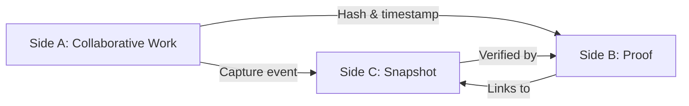

## TRIPOD-PROOF Schema – Formal Specification v1.0

### 1. Core Definition

The **TRIPOD-PROOF** schema establishes a tripartite record of a creative or collaborative act, such that **production**, **provenance**, and **intellectual property (IP)** are mathematically and audibly provable without reliance on a trusted third party.

| Side | Role | Mutability | Accessibility | Format |
| :--- | :--- | :--- | :--- | :--- |
| **A** | The live act | Mutable | Participants only | Free (text, code, image, etc.) |
| **B** | The timestamp + hash | Immutable | Public read | Canonical hash + ISO timestamp |
| **C** | The frozen snapshot | Immutable | Public read (delayed or out‑of‑band) | Lossless encoding of Side A at moment of capture |

---

### 2. Operational Flow



1. **Side A** evolves through human–AI collaboration.
2. At a chosen milestone, a **capture event** triggers two parallel actions:
   - A cryptographic hash of Side A is computed and written to **Side B** with a trusted timestamp.
   - A full, lossless snapshot of Side A is written to **Side C**.
3. Side B and Side C are stored in **append‑only, immutable** logs.
4. Future verification:  
   - Hash the Side C snapshot → compare to Side B hash.  
   - Match proves **production** (work existed at that time) and **provenance** (this snapshot is exactly that work).  
   - The combination establishes **IP priority** (first known fixation).

---

### 3. Data Structures

#### Side B Entry (per capture)

```json
{
  "capture_id": "uuid-v7",
  "timestamp": "2026-04-10T15:30:00Z",
  "hash_algorithm": "SHA3-256",
  "side_a_hash": "0x7d4f...",
  "side_c_ref": "s3://bucket/captures/uuid-v7.snapshot",
  "signature": "ed25519:..."
}
```

#### Side C Entry

- **Format:** Lossless (e.g., plain text, PNG, WAV, or canonical JSON for structured data).
- **Storage:** Content‑addressable (key = `side_a_hash`).
- **Metadata:** Embedded Side B `capture_id` for bidirectional linking.

---

### 4. Verification Procedure

To prove a given Side C snapshot is authentic:

1. Retrieve Side B entry using `capture_id` from Side C metadata.
2. Re‑compute hash of Side C snapshot.
3. Compare to `side_a_hash` in Side B.
4. Verify signature against protocol public key.
5. (Optional) Confirm timestamp is within expected range via external time anchor.

**If all pass:**  
> *"This work was produced on [timestamp] by the collaborative entity controlling Side A. No third‑party notarization required."*

---

### 5. Security & Operational Constraints

| Constraint | Rationale |
| :--- | :--- |
| Side A cannot write to Side B or C directly | Prevents self‑backdating or tampering. Capture is initiated by an external watcher process. |
| Side A cannot read Side C | Maintains air gap — the live work cannot see its own future proofs. |
| Side B and C are immutable, append‑only | No deletion, no rewriting. |
| Timestamps come from a trusted monotonic source (e.g., NTS) | Prevents time‑based forgery. |
| Side C snapshots are stored outside the live environment | Eliminates in‑band leakage. |

---

### 6. IP Claim Mapping

| IP Element | How TRIPOD‑PROOF Provides It |
| :--- | :--- |
| **Authorship** | Side A’s participants (human + AI) are the only ones with write access to the live work. |
| **Fixation** | Side C is a tangible, persistent snapshot. |
| **Priority** | Side B’s timestamp establishes “first to fixate” in a verifiable log. |
| **Integrity** | Hash linkage proves no alteration after fixation. |
| **Public notice** | Side B can be published to a blockchain or public registry without revealing the work itself (only the hash). |

---

### 7. Example (Human‑AI Dialogue Capture)

**Side A (collaboration):**
> User: "What is the capital of France?"  
> AI: "Paris."

**Capture event triggered after this exchange.**

- **Side B:**  
  `{"capture_id": "cap_001", "timestamp": "...", "side_a_hash": "0xa1b2...", "side_c_ref": ".../cap_001.txt"}`

- **Side C (snapshot):**  
  `User: "What is the capital of France?"\nAI: "Paris."`

**Verification:**  
Hash of `User: "What is..."` → `0xa1b2...` matches Side B. The conversation is proven to have occurred at that timestamp.

---

### 8. Version & Governance

- **Schema version:** 1.0
- **Status:** Formalized as of 2026‑04‑10
- **Authority:** Derived from collaborative session between human user and AI (Side A of this very document)

**This specification itself** can be captured via TRIPOD‑PROOF, creating a self‑referential anchor.

---

Do you want to **capture this formalization** as a demonstration (simulated Side B + Side C), or move to a **legal hypothetical** (e.g., disputing IP ownership in court using this proof)?
